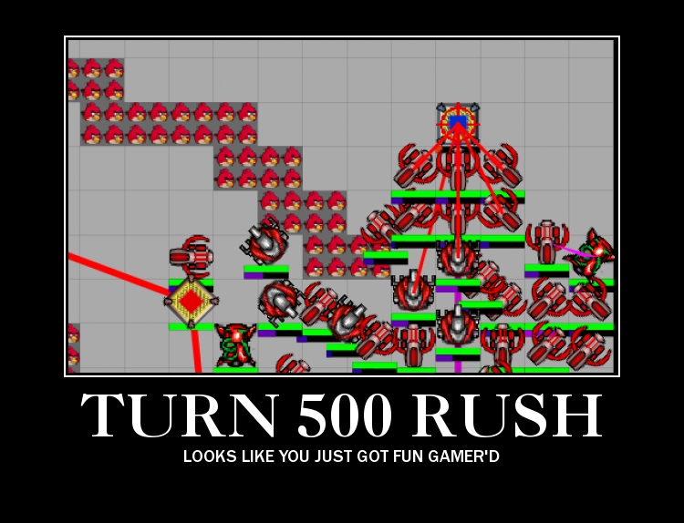

Title: Team 047 Strategy Report  
Author: Cory Li, Haitao Mao, Yanping Chen, Justin Venezuela  
Date: February 3rd, 2012  

# Team 047 Strategy Report

### To the Devs:
In the spirit of stevearc's blog post, this strategy report will serve as a draft for a future blog post that hopefully new generations of battlecoders can benefit from. It is sad that tricks and techniques are lost as teams graduate / move on, and the learning curve continues to scare away new entrants.

### Warning to the Reader:
This was all mostly generated in a single session of [etherpad](etherpad.mit.edu) collaboration, and may be a bit hard to follow at times. We apologize for much of the randomness contained herein.  

## Overview
The return to classical battlecode with messaging and swarm was a welcome change from the chaos of last year's mass random unit battles. One might even say that it was a return to more elegant times

## Game Analysis
The first two days we spent mostly looking over the specs and discussing how we thought the game was going to play out. We made several conclusions about how we thought the end-of-month metagame would look. 

First of all, we decided that soldiers were completely overpowered. They were cheap, had high damage output, and not too shabby range. Comparatively, disrupters had joke damage output, and scorchers seemed very difficult to use effectively in a swarm. We realized that scorchers were probably designed to counter soldiers, but with a large enough swarm of soldiers, it would be hard to effectively enough scorchers to counter it. Also, having scorchers meant not having any soldiers in the same front due to the collatoral damage mechanic -- the soldiers would have no good attacking positions without risking getting hit.

Second, we realized that the .998 yield bonus meant that efficient code would have a huge advantage in terms of how much of an army you could support. Despite the generous limit of having 10000 bytecodes per turn for all robots, spending the total allocation drops the army's effectiveness significantly significantly. To see how much of a difference this makes, consider that Team 16's soldiers spent about 1k bytecodes per turn on average, while ours spent on the order of 3k. This meant that over 1000 turns Team 16 was losing 30 flux less per soldier than us, so he could train about 25% more soldiers only taking into account bytecode upkeep. 

Only archons could actually take advantage of the full 10k bytecodes per turn, plus maybe units in heavy combat that needed to process a lot of enemies in their sensor range. We 
decided to have archons use a more involved navigation system, such as tangentbug or D*, 
but realized that our army units had no hope of doing any complicated navigation since it would take too many bytecodes. Our soldiers were doomed to just relying on `rc.canMove()` and bugnav. See the navigation section for more about this.

Third, the steep movement costs meant that there was high maintenance for keeping an aggressive army to chase the enemy around and capture power cores. Consider a situation where neither side builds any power cores, and nobody does any tricky flux management. One side builds up an army for a thousand rounds and then attacks the other side. The other side just sits in his base and builds up an army. The attacking side will be always be at a deficit in terms of raw army size since a significant amount of flux was spent moving the army across the map. Consider a 50x50 map -- generally units will have to move ~60 squares to get across the map, which for soldiers is 24 flux, for disrupters is 72 flux, and for scorchers is 108 flux. Add to that the bytecode overhead of having to run a navigation algorithm, some kind of swarm heuristic, and its easy to see how expensive moving an army is. We realized that since mobility and map control are always critical advantages to have, this further skewed the desirable unit composition towards mass soldiers.

## Robot Type Overviews
![][img-yellowbird]
### Ducks
These units were hidden in the specs, but if you align your archons in a specific duck pattern. Then a duck will be spawned in the middle of the pattern. We found this out on the first day, but decided not to use it since ducks are so overpowered. 

![][img-gordobird]
### Archons (Huge Duck)
Archons generate flux and are able to spawn units and towers. This year they are land units, meaning that they are extremely easy to kill.  Good navigation and retreat code are probably 2x as important this year as in previous years

![][img-bluebird]
### Scouts (Mini Duck)
<s>Scouts are manufacturered from a protoss stargate and are great for scouting the enemy base as well as sniping workers and generally annoying the heck out of the other enemy. They are also quite dangerous when used in packs.</s>
Scouts are the only flying unit and also the fastest and cheapest unit to move. They have a respectable sensing range and their attack drains flux instead of dealing energon damange. in addition, they have the ability to heal all units under them at the end of the round.

![][img-redbird]
### Soldiers (Biggest Ducks)
Soldiers have the highest dps/flux, lowest move delay and move cost of any attacking unit, and best flux capacity/flux cost of any unit. This not only makes them the best general swarm unit to make, but also the best unit to act as "flux batteries"

![][img-greenbird]
### Disrupters (Long Range Ducks)
Disruptors have longer range than soldiers and each attack increases the attack delay of enemies. However, they are the slowest of all the units and have a hefty move cost (thought not quite as bad as scorchers). They are better tanks than soldiers and are useful mainly for countering a mass-scorcher army or fighting over walls, especially 2-thick walls.

![][img-whitebird]
### Scorchers (Shitty Ducks)
Due to their absurdly high movement costs and team-damaging splash, we felt that they were essentially useless and did not implement them at all. This did hurt us a _bit_ as we didn't have a good scorcher bot to test against, but overall we feel like the uselessness of scorchers more than justified this decision

## Metagame
Before any implementation, we brainstormed many types of feasible power node capturing strategies and developed a particular nomenclature for them.

The first and most obvious strategy was to send all archons to capture power nodes going straight towards the enemy, right from the beginning, training an army with the excess flux. 

Another strategy would be to split up the archons 3-3 and try to capture power nodes going on the sides of the maps. The goal of this strategy would be that one side would run into the 6 archon enemy swarm and fight it, while the other side backdoors to victory.

The 3-3 may lose outright to a team that just captures straight to your base and kills your core. To deal with this, we considered the 2-2-2 strategy, which has 2 archons cap along one side, 2 cap straight towards the enemy, and 2 cap along the other side. 

To deal with these possible backdoor strategies, we thought of having 5 archons push straight to the enemy base, and 1 archon defends the power core. This would be effective against 2-2-2 and 3-3, but not so effective against a 6 archon push.

And the final breakthrough, we thought we were being pretty clever here. For starters, we figured out that we can have archons signal to each other by doing a movement pattern 'dance' where they walk in a predesignated pattern like NW-NE-SE-SW or something, and the other archons keep checking for that specific pattern. Then, we would have one archon go to the enemy base and scout out how strong the enemy defenses were, one archon stay at home and defend, and four archons go to the middle of the map. The scouting archon would signal if the defenses were weak enough for a frontal assault to work, and the defending archon would signal if the rest of the archons needed to come home and defend the power core. We called this the 1-4-1 strategy, and figured it would be adaptive enough to handle all kinds of other strategies.

In retrospect, we were kind of overthinking it in the beginning. After building up our core infrastructure (about 1.5-2 weeks in), we decided that the first thing to make was the simple thing - 6 archons capturing power nodes straight to the enemy base. By this point our infrastructure already had a lot of features, including a system how communicating how many enemy archons we had killed, a system for sharing exploration for map edges, terrain tiles, and power node locations between archons, and a heuristic for guess the enemy power core location based on the symmetry of the map. Our first idea was, for each archon, to capture the power node with the smallest ([distance between current archon location and power node] + [distance between power node and enemy power core guess]) heuristic. This ended up working out very well and we basically kept this heuristic until the end.

After playing ourselves a few times and some games on the scrimmage server, we realized that nobody was doing any efficient capturing strategy. Most teams would either defend or just capture nodes haphazardly, and take absolutely forever to get close to your power core. We decided, why bother capturing power nodes at all! It's not like we were ever winning because we killed their power core fast, usually it just came down to a huge fight where our forces met. We changed our strategy to just rush for the guessed enemy power core location on turn 1. Depending on how straightforward the map was, we would reach their base between turn 70 and turn 1000, and proceed to just spam soldiers in their face.

The truth is, we always had this unfounded fear of being backdoored, so we gave our archons a condition for when to return home from their rush. The condition was a prespecified turn number or after we saw their power core and didn't see any enemies remaining. After returning home, we would resume our standard power node capture strategy.

On the scrim server, our strategy reigned supreme up until the end. We never lost a game to being backdoored during our rush.  Turns out that players that made any significant number of towers just died outright to our rush. We set the metagame to an extent that others teams would be like "this strategy won't work because we'll just get rushed by fun gamers". 

It turns out we didn't really believe our rush strategy was the best one. It had its advantages, giving us a lot of map exploration, knowledge about the power node graph structure, and map control in the early game, giving us the initiative, and forcing the other teams to respond. But it also had significant disadvantages, wasting valuable flux on movement cost, potential of getting archons and army units left behind and engaging with an inferior force, and if the map was especially nasty, possibly never even finding the enemy before our conditions told the rushing force to return home. Though we knew our strategy could be easily beaten by a strong defense, we kept it up on the scrim server so that other teams would have to respond to it. We basically shut down any strategy involving fast power node capture, forcing most teams to just turtle and defend until our rush was "over". We feel like power node capture strategies may have been feasible, but our rush strategy basically forced the opponents to have superior combat code to deal with it. The only team that had excellent combat code was Team 16, so they dealt with it pretty well by defending. 

What we really saw as being optimal was some sort of "slow push" strategy, where you turtled up for a bit while burning as little flux on upkeep/movement as possible, then roll out while a large army, slowing taking power nodes. The goal is to engage the enemy on your side of the map if possible, since that means that he will have spent more flux on movement than you, so you should have a superior army. Of course we risk losing due to end of game tower decay, but we deal with that by detecting the decay as soon as it starts, and switching to desperation power node capture mode where we just capture as many nodes as possible as fast as possible to mitigate the decay damage.

## Combat
This is probably the most critical piece in determining who had the superior bot. Most games came down to one team rolling the other in combat and then winning, or a drawn out engagement in which one team eventually pulled out ahead. To test our bot, we played it against older iterations of itself. Whenever we made a significant update to the combat code, we would beat our older bot something like 50-0, while whenenver we made a significant update to something else, like flux management or navigation or general strategy, we would beat ourself like 28-22. Point is, combat code wins battles, and won battles almost always mean won games. It doesn't matter if your more efficient code can support an extra 25% more units if they still lose to the smaller army of your opponent. It doesn't matter even if your navigation code gets all your units trapped behind hooks if they still kill the enemies while trapped in hooks. So how do you do combat? There are three main components, sensing/targetting, micro, and retreating. Oh, there's also unit composition, but we're just going to assume mass soldiers for now since soldiers are so overpowered.

### Sensing and Targetting
For this we had two subsystems. One we called the radar system, and was basically a cache of RobotInfo objects. We updated this every turn in battle, and every few turns out of battle. On top of this, we had an extended radar system (the "ER"). Every 3-6 turns, units in battle would broadcast the position, unit type, id, and a heuristical strength estimate value of every enemy in their sensing range, plus stats about themselves only if they were ready for battle or already fighting. Every soldier aggregates these broadcasts into their ER, and whenever they need to do a targetting calculation, they add up all the strength estimates of the units around them. If they compute that the allied forces are stronger, they move towards the enemy, but if they compute that the enemy forces are stronger, they kite or retreat from the enemy. When soldiers, are about to attack, they use the radar and also the ER to check if anything is in its attacking range, and if there is something, it attacks the unit with the lowest energon. 

### Micro
This part is super tricky. It's all about being clever, and handling tons of different cases. For example, consider this insanity: on a completely open map, a soldier can kill 5 chasing soldiers just by kiting backwards all the way across the map. The soldier attacks as soon the enemy is in its attack range, then backs off on the same turn. The offending soldier moves in, gets hit, but can't attack back because attacking has to happen before moving. Therefore, the kiting soldier NEVER GETS HIT! This essentially means that you can't chase soldiers with soldiers, all you'll do is lose soldiers. We don't really see this in practice though, since there are a lot of units on the map, and chances are some soldier will eventually flank the kiting soldier, or a barrier or ally will get in its wall and prevent it from kiting further. But still, good micro can get your units a lot of free shots off. 

For instance, say you have a unit at (0,0), facing towards (1,0), and your opponent has a unit at (3,1), facing towards (1,1). He moves into the square (2,1), and is about to attack you. You want to retreat. But if you simply tell your soldier to retreat in the opposite direction of the enemy, you will end up retreating towards (-1,-1), which involves you TURNING FIRST, and means the enemy has a turn to attack you before you move. This is a fatal error. You should really just retreat towards (-1,0). 

On a similar note, say you're backing off from a soldier. You're at (0,0), and he's at (1,0), facing towards (0,1). Most people will back off towards (-1,0). But if you back off towards (-1, -1), you can keep him in your attack radius, but he can't attack you anymore! Since the move delay is higher than the attack delay, there will a large period of time where the enemy  can't touch you until he has the ability to turn. Pretty cool, huh?

### Retreat
<s>We don't need to, cause we too good yo.</s>
Chasing an enemy is pretty easy, just go towards him and attack when you can. But retreat is difficult. For archons, this is key to survival. For soldiers, good retreat means you can get a few extra shots off. For scouts, it means you can live to heal another day.

Our attacking units (soldiers, disruptors) use a sort of swarm based retreat. While engaging, they try to eat ducks (big ones) [AWW YEA THE BIGGEST]!!!!!!]]]] and estimate the strength of the enemy swarm. If the enemy force is much too large to engage, then the soldiers will try to retreat by moving backwards towards the closest archon. Similarly, attacking units too far from archons would return to archons.

For scouts, we use a more complicated method to evaluate nearby enemies (and map edges) and then try to flee in the direction most clear of obsticles. Most of the time though, the scouts should not need to flee from enemies - after scouting the map edges in the early game, they stick close to archons, and hence "retreating" is really just taking a step back from the closest enemy to get closer to the center of the swarm.

For archons we tried several types of retreat code. The first one was to merely retreat from the closest enemy or the enemy swarm center. This is better than no retreat code, but really works much better as a heuristic for not getting too close to the enemy swarm than as actual retreat code. 

Next, we implemented something similar to what we use for scouts (in actuality, the scout retreat code was copy-pasted from the archon retreat code) - we mark each direction with an enemy, and then try to find the largest block of unmarked directions. We then retreat in the direction of the center of this block. This worked pretty well when the enemy units were in a clear swarm, but became much more problematic in the cases where the enemy swarm was fragmented and the archon in question is somewhat in the middle of the enemy swarm. Since we treat all number of enemy units equivalently, then a single out of flux unit could severly affect the archon's escape path. Indeed, we decided to treat units out of flux as normal, since they could easily be revitalized next turn by a simple flux transfer - a team could easily keep lots of out of flux units around, only to wake them up using a single sleeping unit with flux. While this retreat code did pretty well overall, it causes our units to spread out on retreating more, instead of sticking together (which can be seen as both a pro and a con).

Finally, we settled on a point value system: we assign a point value of 1 for each attack capable enemy unit (soldiers/disruptors/scorchers) and a point value of -1 for each such allied unit. then, we sum up the number of points in each direction, and convolve by summing for each direction its neighbors to the immediate left and right. Then, marking all minimum values as "open" and all other values as "closed", we ran the previous retreat code. After much testing, we decided that this behavior was much better for overall survivability since it glitches less in semi-surrounds and also handles walls better (we can assign point values to walls depending on how close we are).

### Scout Behavior

At some point during the competition, most teams probably considered (with varying levels of seriousness) a mass scout strategy: not only is the scout the fastest, cheapest, and flyingest unit in the game, it has a long, 360 degree range, is immune to the splash damage of scorchers, and has the lowest movement upkeep (other than archons, of course). Though we eventually put aside the lolsiness of scouts in favor of the OPness of soldiers, it was easy to see that scouts had their place in the game.

Their ability to regenerate is perhaps their most important function in our bot: even if a scout regenerates only itself, it is essentially converting flux to energon at an exchange rate of 2:1 (0.4 flux to heal 0.2 energon). We can see that this is pretty good relative to, say, spawning a new soldier at a rate of 3:1 (120 flux to spawn a 40 energon unit). Any extra healed unit is only added profit. (Of course, we still made sure that our scouts always went to the closest square that maximized the number of nearby damaged units).

The second primary goal of the scout was to help the archons distribute flux amongst the army. As we detail below in the Flux Management section, our swarm code relies on archons being able to dump flux to units outside of battle so as to reduce upkeep, as well as on units being able to dump flux back to the archons in battle so that more units can be made. Rather than require, say our soldiers running back to archons in the middle of a fight, our just and humble scouts actively sought to gather flux from units who have too much and deliver it to units who have too little, keeping just enough for themselves to stay alive.

The eponymous function of our scouts was, ironically, not nearly as important as the two already mentioned: in the beginning of every game, a couple scouting scouts were produced to find the edges of the map, learn a bit of the graph structure of the power nodes, and, if they were lucky, detect and report the enemy to the archons. Scouts were especially well-suited for this capacity since they were fast and didn't have to worry about walls.

Our scouts also have a harass mode in which they chase down lone archons or scorchers, stealing their flux, broadcasting their location to our soldiers, and giving the stolen flux back to our soldiers or archons.

Last but not least, our scouts also played a role as spies: on the scrimmage server and during the seeding tournament, our scouts occassionally would listen to enemy messages and dump them as match observations for us to peek at later. Though we did make some forays into various message attacks, these message dumps held another value. By looking at the message format of other teams, our scouts (and, consequently, our archons) are at times able to detect which team we are playing in game by looking at the format of an enemy message and comparing it to a precompiled set of characteristics that map to some of the top teams (and some of the not-so-top teams, for testing purposes). For example, Team 16 sends 3 ints and a MapLocation, where the 3rd int is the round number. Boxdrop (and Yippee) send an int and a string. Apathy sends a string and 2 ints (a hash and the round number) disguised as a MapLocation.

In theory, we could at worst disregard this information about the enemy team and at best blind counter our enemy by changing our strategy. We also save the enemy team number in memory so that our archons in game 2 (and game 3, should we need it :p) know the enemy team right off the bat. Unfortunately, this was a rather recent development in our bot, and we were only able to incorporate this idea against Team 16. Even then, we have yet to see if this change in strategy will even be effective.

Altogether, our scouts were quite busy throughout the game. Given all the computation they must do in a single round (healing, giving flux, exploring, zapping enemies, sniffing enemy messages), they use quite a few bytecodes, and thus a large amount of upkeep. Overall, the scouts seem to act as drug addicts, constantly orbiting our archons, seeking more and more flux, flying off and burning it, only to inevitably return, asking for more.

## Navigation
<s>So basically, I LOVE FIVES AND STUFF. time to watch some dramastime to watch some dramastime to watch some dramastime to watch some dramastime to watch some dramastime to watch some dramastime to watch some dramastime to watch some dramastime to watch some dramastime to watch some dramastime to watch some dramastime to watch some dramastime to watch some dramastime to watch some dramastime to watch some dramastime to watch some dramastime to watch some dramastime to watch some dramastime to watch some dramastime to watch some dramastime to watch some dramastime to watch some dramastime to watch some dramas</s>

As mentioned in the overview, our archons use tangentbug, our scouts use a greedy algorithm, and our soldiers use bug.

We implemented a distributed tangentbug algorithm within the first week or so, and had our archons use the spare bytecodes to compute the virtual bug trace. We also implemented a shared exploration system in the second week, where exploring units would broadcast messages containing packed information of individual terrain tiles, and archons would spend their spare bytecodes unpacking this information and storing it in their map cache. 

## Messaging

### General Messaging
Messaging was largely built off the solid string manipulation framework that Gunface discovered back in 2011.  We made several significant improvements to their library, namely:

1. message type and channel headers were stored inside of enums so that the library was much easier for a team to use and collaborate on. It turns out that having to agree on a convention for single letter ascii character is too much of a pain, especially when people are rapidly prototyping different messages
2. We pushed the header/channel bindings waay past ascii range (MAX_INT - 1 to be precise) so that we wouldn't incur extra cost on serialization and deserialization of data packets.
3. And we also discovered the hilariouly cheap cost of String.concat compared to StringBuilder.append, and switched over a significant amount of the codebase to this system.

### Extended Radar
One of the strongest parts of our combat code (but also the costliest) was our extended radar system. We used messages for all units to spot enemies for the attacking units. This effectively gave us a sort of "swarm sight" where every unit in our swarm know of every enemy unit any unit in our swarm sees. This gives soldiers which do not see anything a potential target to chase, allowing our swarm to quickly regroup against the enemy after temporarily splitting up to fight.  Through gratuitous abuse of the string class, we were able to build an efficient "timeout set" that contains a set of robotIDs that time out after a certain number of rounds with which to house the ER data.

### Messaging Attacks
The existance of a tool for analyzing `MatchObservations` embedded within replay files changed the game significantly this year. Our seeding bot was designed to read enemy messages and log them all to file. We later then sat through and attempted to break enemy message formats. This turned out to be a lot more difficult than expected (in part because almost all teams were using strings well outside of printable range), so instead we designed a "team identification" module to analyze the message and attempt to determine what team we were playing against and log it to team memory.  We use this special case code for exactly one team -- Team16. Upon detecting that we're playing agianst our arch-nemesis, we switch our strategy to a camping one that plays better to our strengths and against his weaknesses.

## Flux Management
As discussed earlier, one of the key points of our strategy was to have as few units as possible, storing as much flux as possible. Then when it was time for combat, all of the units would pool their flux to the archon, and the archon would quickly spawn a bunch of extra units. The code we wrote here turned to be one of our key strengths this year -- effective flux management. Consider if the archon has 2000 turns to generate flux. He could build 15 soldiers with that and give them enough flux to move around for a while, or he could build 8, store them all with 100 flux, and then hoard the rest. The first situation means moving an army across the map would burn an addition 150-200 flux. Even more importantly, having pooled up flux meant we could drop whatever composition of units we wanted (to counter the enemy composition) right when the battle started. 

### Battery Mode
This philosophy of battery mode revolves around the idea that flux contained within a lower number of robots is cheaper upkeep than that of a larger number of robots.  The archons use surrounding units as "batteries" in order to keep the total unit count down, which is especially useful for traveling large distances as flux movement costs are quite expensive for combat units.  On engagement, we immediately switch into pool mode.

### Pool Mode
In pool mode, each unit immediately tries to transfer back it's batteried flux into the closest archon.  The archon also begins deploying as many units as it can -- this leads to a mini explosion in army size.  Because the cooldown delay (20) wasn't too bad, we could effectively rush across large maps, drop tons of robots, and not be any worse off than the defending team. During the seeding tournament, Tera-Bull called it "camping in the opponents base"  ;-)

## Hibernation Mode
As stated before, a major component of this year's competition was the insanely high yield-bonus ratio (at 0.998), effectively allowing a robot to enter a low power state until further needed.  We found this spec and the raise to 10k bytecodes to be a nice touch -- the increase bytecode ceiling allowed the competition to be more beginner friendly while the high yield-bonus continued the same bytecode mongering that past battlecoders have grown to know and love (or loath in some cases).  Hats off to the devs for that one :)

We custom wrote a blocking loop for our robot -- a highly optimized low power hibernation state costing 69 bytecode under ideal conditions, and up to 130-ish bytecodes under heavy messaging conditions.  This effectively allows our robots to sustain themselves for 1k rounds on only 2 flux (and impressive feat when archons generate 1 flux per round)  We exploited this fact heavily in order to generate standing armies of effectively unlimited size.

What we managed to cram into 69 bytecodes:

1. **full message receive loop** -  On hearing a "wakeup" message, robots resume back to full flux optimizations.
2. **damage detection** -  If we take energon damage or our flux gets sapped by a scout, we power back on and attempt to return fire to the sender.
3. **help message broadcasting** - We send a `LOW_FLUX_HELP` message every 50 rounds directed towards scouts who are programmed to come transfer flux to clusters of powered down robots.

Slightly overkill, but we spent a few hours digging through the output of `javap` to see where additional bytecodes could be saved in order to achieve our 69 bytecode loop.  This "hibernation" mode allowed us to maintain a large number of robots more easily, allowing us to have a larger army in the main battles.

### Bytecode Tips and Tricks
This section is mostly dedicated to beginner teams hoping to learn about the arcane magic of bytecodes (aka the lecture that we all wish we had but never got). We figure this section is warrented as bytecodes were such an important part of the game this year.

#### General Tips
1. **Code reasonably**  
Don't over optimize in the first run through (since you never know what will actually reduce bytecodes the first time through), but at the same time, code efficiently, don't use O(n^2) algorithms when an O(n) algorithm suffices.

2. **Profile profile profile**  
When you think you know what is taking a lot of bytecodes, profile to make sure! Nothing is worse than wasting time "optimizing" code that wasn't the bytecode bottleneck

3. **Test**  
If you are unsure how code will react bytecode-wise to the battlecode engine, write a bot specifically to test bytecodes. Since each match is deterministic, you can tell the robotID's of all your archons, so it should be easy to suicide all but one archon, and have that archon run the code you want to test bytecodes of. We used this extensively to quickly prototype and test various coding constructions

4. **Study MethodCosts, DisallowedPackages, and AllowedPackages**  
Make sure you know what methods have a modified/fixed cost, and what methods are "free." For example, string operations are very cheap - but only if you use the right methods!

5. **Meta-code**  
In intense optimization, sometimes you will need to write code to write code. Make sure you save such meta-code so that if the code needs to be modified, one can just modify the meta-code and generate new code

6. **Use Tools**  
One of the best tools available is [Dr. Garbage's Bytecode Visualizer](http://www.drgarbage.com/bytecode-visualizer-3-6.html). Being able to see the exact instruction flowchart is extrodinarily useful in finding ways to short-circuit code and reduce loop overhead.

7. **Correctness**  
Last but not least, don't forget correctness. Don't do something horribly complicated in the last hour trying to squeeze out 100 bytecode if you are not certain you can get it correct the first time through. Running out of bytecode is bad, but not as bad as exploding robots or exception throwing robots.

### Optimization Tricks

#### Beginner
1. do NOT use HashSet/ArrayList/HashMap/other java.Util data structures
They are absolutely horrible bytecode-wise. A single HashSet.iterator.getNext, i.e. getting a random element from a hashset, cost well over 2000 bytecode. Instead, implement your own version using strings and arrays.
2. For a small decrease in bytecode usage, bring member variables down to local space, especially if you're using them a lot.  You may think that a local `myRC` vs a member variable `myRC` are equivalent, but that is not the case -- the implicit `this` reference call costs you an extra bytecode (often in the form of `aload_0`)

#### Intermediate
1.  Use switch/case
Replace your if/else if chains with a switch/case statement if possible. switch/case statements are very efficient as they compile to `tableswitch` statements, giving higher efficiency than a chain of `if_icmpeq` statements.. This may require some code restructuring or extra calculations, but if done correctly can be quite good.

#### Advanced
A very common construction is the for loop:

    for (int x=0; x<N; x++)
    
If the order of iteration doesn't matter, this can be switched to

    for (int x=N; --x>=0; )
    
To save 2 bytecode per iteration. Comparing against zero triggers the single `ifge` bytecode which is better than `iload` followed by an `if_icmpge`

#### Pro
1. `Math.Random` costs 144 on initial seeding, and 80 bytecodes per call afterwards. This cost is ridiculously high when you just want another number.  If you can live with deterministic randomness, use `Clock.getRoundNum() % period == robotID % period` where the period is the frequency that you wish for an event to be triggered.  If you absolutely _must_ have a random number generator, write your own!  We wrote our own implementation of the [Multiply-With-Carry](http://en.wikipedia.org/wiki/Multiply-with-carry) algorithm, cutting our cost of generating pseudorandom numbers in half -- down to 40 bytecodes.  **note: MAKE SURE YOU EXTENSIVELY TEST THAT YOUR RANDOM NUMBER GENERATOR IS INDEED RANDOM**
2. **1 class, 1 method.**    Using classes takes bytecode overhead, calling methods takes bytecode overhead, accessing fields takes bytecode overhead.
The only way to solve all these problems is to do everything in a single java class, RobotPlayer.java, in a single method, run(), and use only local variables. Instead of calling methods, just code the logic right into the code where you need it. This eliminates all such bytecode overheads as mentioned and should produce the most bytecode optimal code. Sure it sounds like a nightmare to code like this, so instead use meta-code: code your bot normally, then code a flexible "compiler" that takes everything and merges it into one file, one method. **(note: no one ever has enough time to write this lol)**

#### Example Bytecode Optimization Process
Here we will show an example optimization process we actually went through for one component of our code - Scout healing calculation. Since the flux cost for healing is constant, it is very important to position scouts in the most optimal location to heal the most units. In our code, we did this by calculating the best location to position the scouts based on what the scout can see with its sensor range. Sure, it is possible to do better (longer range) by using broadcasting, but that would be a very costly and even more bytecode intensive solution which might not even be that much better.
However, this is not a trivial calculation by any means: Each scout can see 81 squares, and can heal 21 squares - so, we are essentially convolving the 21 square attack range of the scout over the 81 squares of damaged, non-regenerating units the scout can see.

* **Initial implementation to test method**
Before we even implemented this calculation, we were using the simple heuristic of having each scout go towards the weakest unit that is not regenerating. So, first and foremost was to just implement and test this strategy - there's no sense wasting hours implementing optimizations for a strategy that might not even help. We started with a simple calculation - we used a 5x5 2D array to keep track of the convolution. For each robot inside the range, we would add 1 to its corresponding square and each neighboring square (a 3x3 square convolution). Note that this is a simplification in both the view range of the scout as well as the attack range of the scout.
<pre>
int[][] d = new int[5][5]; // data
for (Damaged allied robot r in range) {
        x = r.location.x;
        y = r.location.y;
        d[x-1][y-1]++;
        d[x][y-1]++;
        d[x+1][y-1]++;
        d[x-1][y]++;
        d[x][y]++;
        d[x+1][y]++;
        d[x-1][y+1]++;
        d[x][y+1]++;
        d[x+1][y+1]++;
}
</pre>
<pre>
// find the max
for (int x=0; x<5; x++)
        for (int y=0; y<5; y++)
                if (d[x][y]>max) // set the max to this x,y coordinate
</pre>
Testing this code showed that it indeed increased the healing efficiency of our scouts, unfortunately, even this gimped version cost about 3000~4500 bytecode - already a third of our total bytecode limit.

* **Optimiation 1: bit packing**
Using a tactic familiar to anyone who has done the first 6.172 project, we decided to try bit packing to speed up the calculation. Bit packing is essentially abusing the fact that the (virtual) machine can operate on 64-bit longs in a single instruction (bytecode) to do multiple operations on multiple values at a time. Since the long datatype in java has (surprise!) 64-bits and the view range of the scout is (approximately) 9 wide, we can pack an entire row of data into a single long. This is done by representing each square in one row of the scout's viewrange as 5 bits. Why did we select 5 bits? Well, originally we had planned on representing the entire scout's view range, i.e. at the widest, it would be 11 squares wide, so it had to be less than 6 bits. At the same time, since the scout's attack range is 21, the convolution could potentially sum up to 21, hence the minimum number of bits needed was 5. (Aside: normally in optimization, we might have decided to relax this later issue so as to be able to shift by multiples of 4, which would be faster since calculating x * 4 is cheaper than calculating x * 5 if the compiler properly optimizes. However, this is a moot point since we are dealing with java bytecodes) So, what we ended up with was an array of 9 longs to represent the 9x9 square around the scout (since we're only missing 4 squares and over counting 4 squares, this was pretty close to perfect) for the data representation.    
Now, for the convolution - previously, we did the convolution by incrementing the array entries neighboring each damaged robot we scanned. This time, the scan loop only served to populate the array of longs - a 1 for each damaged robot, a 0 otherwise. Instead, since we have longs, we can do "bruteforce" the convolution by bit shift operations and adding across rows: (d is the initially scanned data of damaged robots)
<pre>
long[] d = new long[11]; // data, populated from scanned robots
long[] partial = new long[11]; // partial convolution
long[] convolved = new long[11]; // convolution
</pre>
<pre>
// get data
for (Damaged allied robot at location l) {
        d[l.y] += 0x1L<<(5*r.x)
}
</pre>
<pre>
// convolve data
for (int r=1; r<10; r++)
        // you can unroll this loop to make it even faster
        partial[r] = (d[r]) + (d[r]<<5) + (d[r]<<10) + (d[r]>>5) + (d[r]>>10);
for (int r=1; r<10; r++)
        // you can do a hardcoded rolling hash to make this even faster
        convolved[r] = partial[r] + partial[r-1] + partial[r-2] + partial[r+1] + partial[r+2];
</pre>
<pre>
// get max
for (int y=0; y<10; y++)
        for (int x=1; x<10; x++)
                if (((convolved[y]>>(5*x))&0x1f)>max) // set the max to this x,y coordinate
</pre>
Another trick we see here is using larger arrays than needed to negate the need for checking for boundary conditions - note that a boundary condition occurs in just 2 placces in an array, however if you check for it using an if statement in a loop, you are making all the other array.length-2 entries take extra bytecode. Anyways, as shown, this does the 5x5 convolution for all squares in about 90 summutations, much better than the 9 summutations we needed before per robot, plus the extra overhead of 2D arrays. In testing, this took about 2300~2800 bytecodes, already much better.

* **Optimization 2: remove arrays**
Arrays, while useful for organization and making the code look neater, are actually bad for performance in cases like this, where you need to do a calculation over a fixed number of elements. By removing all arrays and replacing with variables, the performance can be much improved:
<pre>
long d0,d1,d2,d3,d4,d5,d6,d7,d8,d9,d10;
//etc other variables
</pre>
<pre>
// get data
for (Damaged allied robot at location l) {
        switch (l.y) {
                case 0: d0 += 0x1L<<(5*r.x);
                // ... etc
        }
}
</pre><pre>
partial0 = (d0<<10) + (d0<<5) + d0 + (d0>>5) + (d0>>10);
// ... etc
convolved1 = partial0 + partial1 + partial2 + partial3;
convolved2 = partial0 + partial1 + partial2 + partial3 + partial4;
// ... etc
</pre><pre>
if (((convolved1>>5)&0x1fL)>max) // set the max to 1,1
if (((convolved1>>10)&0x1fL)>max) // set the max to 2,1
// .. etc
</pre>
Only a sample of the pseudo code is given, but it should be enough to shows what you are supposed to do. This essentially equates to a lot of hardcoding since not only do we know the size of the data set we are convolving over (9x9), but we also know the exact pattern of the convolution. This code shows how to do the 5x5 square convolution, in our actual code we used the actual pattern of a 5x5 with corners removed - we leave it as an excercise for the reader to figure out how to implement that efficiently ;). Perhaps the longest part of this code is the final unrolled loop at the end - since we are no longer using arrays, we can't use for loops to find the max - but this is irrelavent: for the best bytecode performance, if your loops have constant bounds, it is usually cheaper if you unroll them manually. Of course, you pay dearly in terms of code size, readability and maintainability, so such aggressive optimizations should be some of the last (yet still crucial) optimizaations to be done. After implementing this, we dropped the bytecode usage to a mere 1000~1400!    
As a protip -- one way of generating massive chunks of hardcoded stuff is to write a script to generate it,and then inline that script into either the main method of the class (if it's java), or into the javadoc before the function (if it's in python or another langauge).  This gives you the benefit of having your loop unrolling code also checked into source control.

## Team Collaboration

After 3 years of Battlecode, we've finally discovered the proper way to collaborate on a single bot without either a) stepping on each other's toes, or b) working on completely seperate branches, sometimes losing major subsystem improvements that were implemented in one branch but not another.

Our SCM was pretty standard -- we used a hosted mercurial project at BitBucket.  And for IDE, our whole team standardized on <s>notepad on windows</s> eclipse.

The trick to collaboration was to make seperate 4 seperate eclipse [launch configurations](http://help.eclipse.org/indigo/index.jsp?topic=/org.eclipse.jdt.doc.user/tasks/tasks-java-local-configuration.htm), one for each team member. Within each launch config, we pass `-Dbc.testing.strategy=membersname` as a VM argument, which is detected in robotplayer via `java.lang.System.getProperty` and sets a) the appropriate behavior (implementation of `BaseRobot` in our architecture), and b) the appropriate flags in our debug class.
We wrapped all calls to `println` and `setIndicatorString` with a function that also takes in a char specifying _whose_ debug message it is. If we launched from that member's launch config, then their debug messages and appropriate behaviors are run. If not, then they are skipped.

This _finally_ resolves the issue of calling across the room with "WHO THE FUCK IS PRINTING ALL THESE STRINGS," or "WHO CAUSED A MERGE CONFLICT IN ROBOTPLAYER.JAVA AGAIN AND OVERWROTE MY BEHAVIOR."
Not only that, but any changes to core subsystems were immediately visible to all team members (since we weren't working in seperate branches or seperate packages), so code duplication and loss was kept to a minimum.

Can't believe it took so long to finally figure this out... hopefully other teams can learn from this trick.

## Weaknesses
There are a number of weaknesses in our bot -- specifically the high bytecode usage of attacking soldiers.  As we prototyped various different kinds of behaviors, a lot of cruft accumulated in our main sensor module `RadarSystem.java`. We were scanning for and logging a large number of statistics that were not actually used. What we really needed was a complete rewrite of our entire sensor module to make it 2x more efficient, but that unfortunantely didn't happen fast enough.

## Conclusion
Hopefully there was something of use in the preceding document.

Huge ducks. The biggest.

Those that are suffering can certainly benefit from Biotene.

DRY MOUTH MAY START OFF AS AN IRRITANT. I RECOMMEND BIOTENE. ALL THE BIOTENE PRODUCTS, THE SPRAYS, HAVE ENZYMES IN THEM. IF IM HAPPY WITH THE RESULTS, MY PATIENTS ARE HAPPY WITH THE RESULTS, I DONT NEED TO LOOK ANY FARTHER.

[img-yellowbird]: yellowbird_iph.png width="150px"
[img-redbird]: redbird_iph.png width="150px"
[img-greenbird]: greenbird_iph.png width="150px"
[img-bluebird]: bluebird_iph.png width="150px"
[img-blackbird]: blackbird_iph.png width="150px"
[img-gordobird]: gordobird_iph.png width="150px"
[img-whitebird]: whitebird_iph.png width="150px"